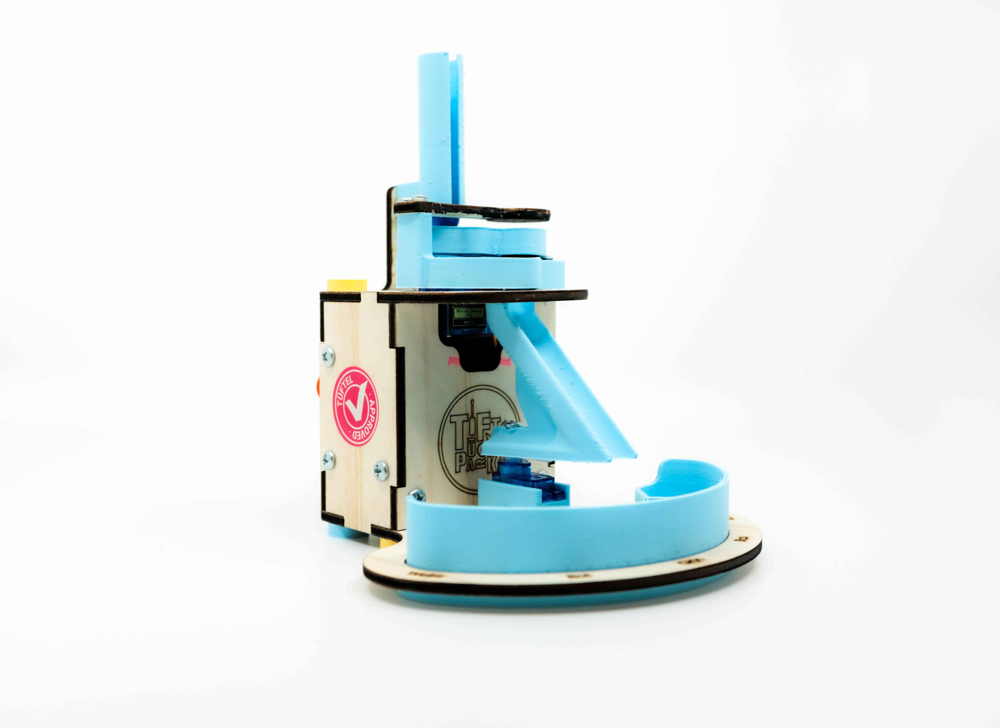

# Sortieranlage

<h3>Baue deine eigene Farbsortieranlage!</h3>

In diesem Workshop werden wir eine Sortieranlage kennenlernen, die auf der Basis einer Farberkennung funktioniert. Du fragst dich vielleicht, wie Farbe mit einem Sensor überhaupt erkannt werden kann? Die Funktionsweise ist ähnlich wie das menschliche Auge. Wir werden mit einem Farbsensor arbeiten, welcher die RGB-Verhältnisse misst und diese dann den Farben zuordnen. Sobald die Anlage die Farben erkannt hat, werden wir gemeinsam in die Programmierung eintauchen. Dabei werden wir die Logik verstehen lernen und einfache IF/ELSE Befehle verwenden, um einen Servo-Motor anzusteuern.

  

 

Lade die gesamte Repository als .zip Datei herunter. Auf deinem Computer kannst du den Rechner entzippen und alle deine Übungen nutzen.

 

<h4> Erklärungen zu den einzelnen Ordner </h4>

 

<ins>00_Uebungen</ins>
 

In diesem Ordner sind mehrere Übungen zu finden rund um das autonome Fahrzeug.
Jede Übung ist die Aufgabe im Code wie auch auf GitHub beschrieben.

 

<ins>01_Hilfsmittel</ins>

Hier sind Beispielcodes und Spickzettel zu finden. Beachte das die hier enthaltene Codes nicht für sich selber funktionieren können. 

<ins>02_Anleitung</ins>

Hier sind Anleitungen aufgelistet zum Aufbau des autonomen Fahrzeugs. 

 

<ins>03_Fertigung</ins>

Hier sind Dateien zur Fertigung des autonomen Fahrzeugs zu finden. 

 

<ins>98_Sonstiges</ins>

 Hier sind sonstige Dateien zu finden.

 

<ins>99_Solution</ins>

Hier sind mögliche Lösungscodes für das autonome Fahrzeug zu finden.

[Zum Anfang der Datei](#anfang)
